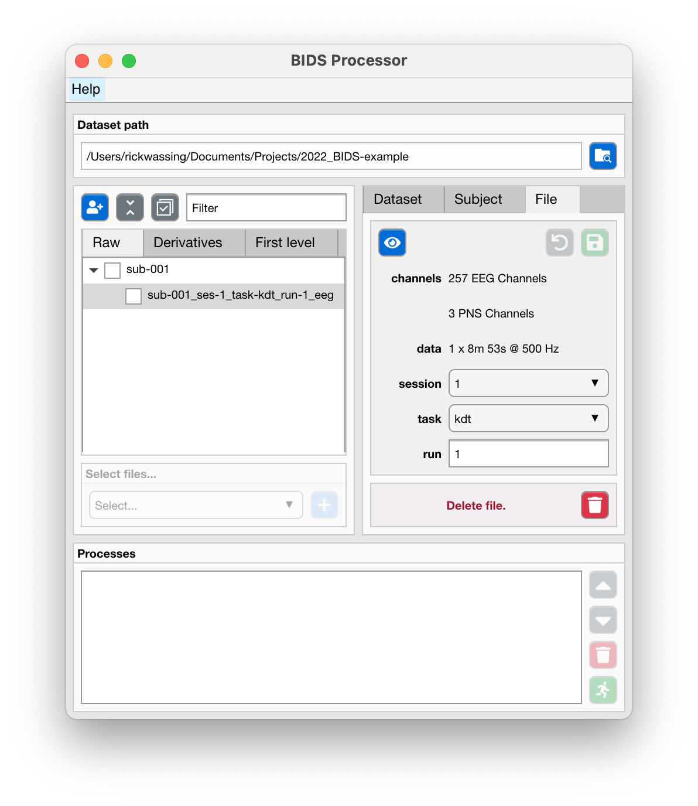
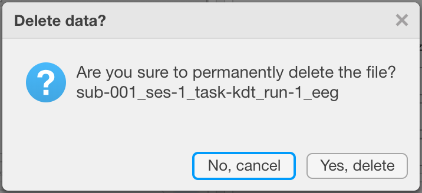

In this section you'll see how you can edit the name of a file and visualy inspect its contents.

==============
Edit file name
==============

The name of a file in the BIDS structure is determined by a set of stringent `rules and specifications <https://bids-specification.readthedocs.io/en/stable/02-common-principles.html#file-name-structure>`_. The filename is build-up of ``key`` and ``value`` pairs, separated by dashes (-), and these key-value pairs are concatenated by underscores (_).

- In the middle right "File" tab, use the dropdown menus and the input fields to change the filename. You will notice that the file in the files-tree will now show (unsaved) behind its name. 
- Use the "Save" button to confirm these changes, at which point the actual file-on-disk will be renamed. Or use the "Undo" button to revert back to the original filename.

----

====================
Delete a single file
====================

- Select a single file in the files-tree in the left center tab.
- Use the "Delete file" button to delete the file.
- A dialog will appear to confirm or abort your action.

----

=================
Inspecting a file
=================

- Select a single file in the files-tree in the left center tab.
- Use the "Inspect" button to open the Visual Inspection application.

This video will outline how to start and use the visual inspection app, and how to inspect your data.

:Chapters:

    0:00 Starting the Visual Inspection application

    0:56 How to use the Visual Inspection application

    16:30 Inspecting the EEG data

.. raw:: html

    <iframe width="560" height="315" src="https://www.youtube.com/embed/qMYy-sL__18" title="YouTube video player" frameborder="0" allow="accelerometer; autoplay; clipboard-write; encrypted-media; gyroscope; picture-in-picture" allowfullscreen></iframe>

----